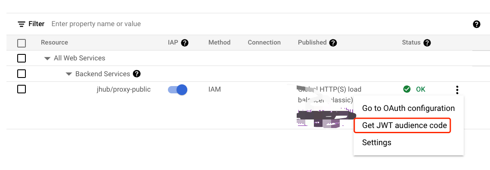

## Jupyterhub GCP IAP Proxy authenticator


This project is following Jupyterhub's offical document "[Writing a custom Authenticator](https://universe-docs.readthedocs.io/en/latest/authenticators.html)"
to build an authenticator for [GCP](https://cloud.google.com) [IAP](https://cloud.google.com/iap) authenticator.

The [JWT token](https://jwt.io/) verfication part was taken from the
[GoogleCloudPlatform/jupyterhub-gcp-proxies-authenticator](https://github.com/GoogleCloudPlatform/jupyterhub-gcp-proxies-authenticator).
project.

However, I eliminate the part retriving `backend_service_id` dynamically.
As it will be a static value once you've had IAP proxy enabled.
This will simply your GKE permissions setup by removing needs to access get [IAP](https://cloud.google.com/iap) config through API.

### Example Config

```yaml
hub:
  config:
    JupyterHub:
      authenticator_class: gcp_iap_auth
    Authenticator:
      enable_auth_state: true
      admin_users:
      - tom
      allowed_users:
      - tom
      - jerry
    GCPIAPAuthenticator:
      project_id: 'YOUR PRJECT ID'
      project_number: 'YOUR PROJECT NUMBER'
      backend_service_id: 'YOUR BACKEND SERVICE ID'
```

### How to obtain the backend_service_id?


1. Go to your Identity-Aware Proxy page in your GCP console.
2. Click the button located on your backend service.
3. Pick JWT audience code.
4. And it should prompt a dialog and display 'audience' claim.




The 'audience' claim is under following format.

`/projects/${PROJECT_NUMBER}/global/backendServices/{backend_service_id}`


